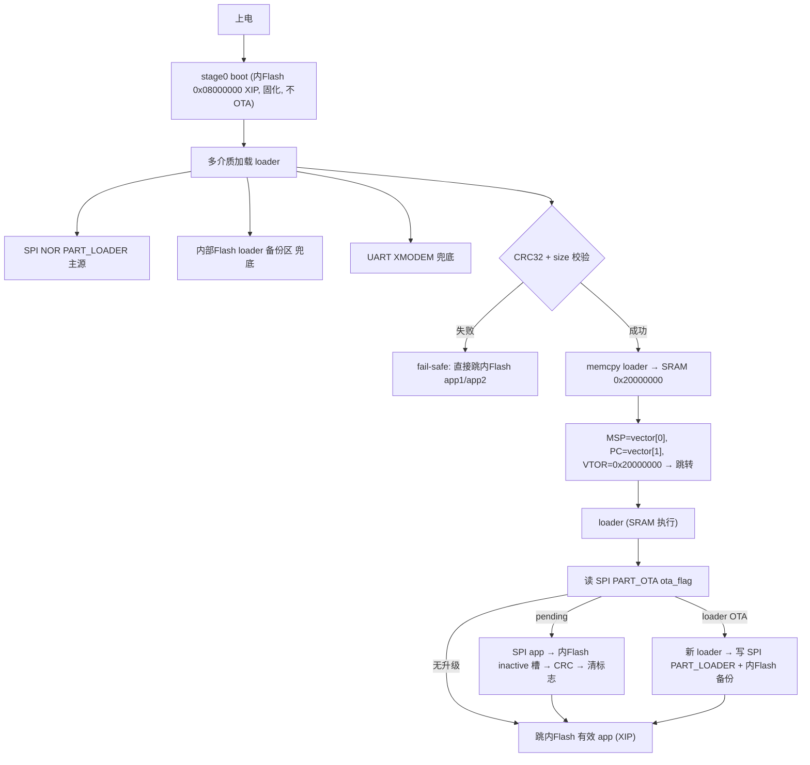

# 搬运式启动架构（stage0 + SPI loader + SRAM 执行）

> 本文档描述当前 boot 架构的整体设计、内存布局、启动流程，以及相关构建/烧录/恢复工具的使用方法。

## 1. 设计目标与硬约束

原单级 bootloader（`loader.bin`，直接固化在内部 Flash）只能从内部 Flash XIP 启动，且 APP 为 **140KB**，大于内部 SRAM 128K、F407 的 FSMC 又无法从外部 PSRAM 取指，因此 APP 只能在内部 Flash 运行。

改造目标：

- **boot 只做"搬运"**：固化一个极简 stage0（内Flash XIP），只负责把 loader 从多种介质读出来、CRC 校验、memcpy 到 SRAM、跳转。
- **loader 可升级**：loader 本体存于 SPI Flash，支持 OTA（APP 上传/串口直接覆盖 SPI 主区，并同步写内Flash 备份）。
- **多介质启动**：SPI 主 loader → 内部 Flash 备份 → UART XMODEM 兜底 → fail-safe 直接跳 APP。

## 2. 总体架构



三个可执行镜像：

| 镜像 | 产物 | 运行位置 | 职责 | 是否 OTA |
| --- | --- | --- | --- | --- |
| **boot** | `boot/build/boot.bin`（亦 `dist/boot.bin`） | 内部 Flash `0x08000000` XIP | 只做加载：SPI/内Flash/UART 读 loader → CRC → 搬运 → 跳转；失败时 fail-safe 跳 APP | 否，固化只烧一次 |
| **loader** | `loader/build/loader.bin`（SRAM 变体） | SRAM `0x20000000` | 完整启动逻辑：分区初始化、APP OTA、选槽跳转、串口收 `upg.bin` | **是**，存 SPI Flash / 进 upg.bin |
| **loader** | `loader/build/loader_flash.bin` | 内部 Flash `0x08000000`（旧方案） | 同上，直接 XIP；仅兼容 | 否 |
| **app** | `app/build/app1.bin` / `app2.bin` | 内部 Flash `0x08008000` / `0x08060000` XIP | 业务固件，双槽 A/B | 是 |

> 日常升级只重新生成 `upg.bin`（或 `upg_web.bin`），用 `tools/xfer/xfer` 串口烧进 loader。`boot.bin` 生产只 SWD 烧一次。

## 3. 内存布局

### 3.1 内部 Flash（1MB）

```text
[0x08000000] stage0 boot      16~32K   固化，只做加载，不 OTA
[0x08008000] APP1             256K     XIP 运行，双槽 A
[0x08060000] APP2             256K     XIP 运行，双槽 B
[0x080A0000] PART_RES         128K     ota_info + host-flash cookie（pyocd 直烧覆盖）
[0x080C0000] loader 备份区    128K     专用扇区，SWD/APP OTA 直写（boot 兜底源）
```

> `0x080C0000` 落在空闲 sector 10（`PART_RES` 结束后），由 `loader_meta.h` 的 `LOADER_BACKUP_ADDR` 定义，不经分区表，防止误擦。

### 3.2 SPI Flash（16MB W25Q128）

```text
[0x000000] PART_LOADER    64K    loader blob（可 OTA，boot 主源）
[0x010000] PART_LOADER_BK 64K    闲置备份分区（布局保留，boot 不再读）
[0x600000] PART_APP1        2M   app 固件源
[0x800000] PART_APP2        2M   app 固件源
[0xA00000] PART_OTA         1M   ota_flag_t（active 槽 + 升级标志）
[0xB00000] PART_LOG         2M
[0xD00000] PART_WEB         1M   web.bin
[0xE00000] PART_CONFIG      1M
[0xF00000] PART_CUSTOM      1M
```

分区表两侧各一份（`bootloader/User/app/main.c` 与 `app/User/app/main.c` 的 `spi_flash_table[]`），**修改必须同步**。

### 3.3 SRAM 分工（128K）

```text
[0x20000000 ─ 0x20010000)  loader 运行区（低 64K，≤ LOADER_MAX_SIZE）
[0x20010000 ─ 0x2001C000)  stage0 堆（专用，不重叠）
[0x2001C000 ─ 0x20020000)  stage0 .data/.bss
[0x20020000]               _estack（128K 顶部，stage0 与 loader 共用栈顶）
```

loader 的 heap 用外部 PSRAM（`link_ram.ld` 中 `.heap`/`.exram` 段指向 `0x6C000000`），沿用 `syscalls.c` 的 `_sbrk`。

## 4. 启动流程细节

### 4.1 stage0 加载顺序（`bootloader/stage0/main.c`）

1. 初始化：SysTick(1ms)、USART、LED、SPI Flash。
2. **SPI PART_LOADER**：读分区头（`PartitionHeader{magic=0x55AA55AA, used_size, crc}`）→ 读 `loader_header_t{magic="2LDR", version, size, crc32}` → 读 body 到 `LOADER_RAM_BASE` → CRC32 校验 → 跳转。失败重试 3 次。
3. **内部 Flash 备份区** `0x080C0000`：无分区头，直接 `[loader_header_t][body]`。
4. **UART XMODEM-CRC 兜底**：连发 `'C'` 握手，接收 `[16B loader_header_t][loader.bin]`，CRC-16(0x1021) 逐块校验 + 整体 CRC32 校验。
5. **fail-safe**：以上全失败 → 校验并直接跳内部 Flash 合法 APP1/APP2（`app_image_valid`）。
6. **全失败**：LED 红灯慢闪，死循环等待 XMODEM 恢复。

### 4.2 跳转方式

`jump_to_loader()`：读 `LOADER_RAM_BASE` 处 vector[0]（MSP）、vector[1]（PC），校验范围后 `__disable_irq()` → `SCB->VTOR = 0x20000000` → `__DSB/__ISB` → `__set_MSP(msp)` → 以 Thumb 位跳转。

### 4.3 关键点：VTOR 必须在 loader 内再次设置

`system_stm32f4xx.c` 的 `SystemInit()` 默认把 `SCB->VTOR` 指向 `FLASH_BASE (0x08000000)`，且 `VECT_TAB_SRAM` 未定义。loader 在 SRAM 运行时若中断会取错向量表。

修复：两个链接脚本都在 `.isr_vector` 起始处定义符号 `__vector_base = .`，loader `main()` 开头执行：

```c
SCB->VTOR = (uint32_t)&__vector_base;
```

- Flash 变体链接到 `0x08000000` → VTOR 写回 Flash；
- SRAM 变体链接到 `0x20000000` → VTOR 写回 SRAM。
- 该方案对"调试器手动把 bin 拷到 SRAM 运行"也自动正确。

### 4.4 loader 内部流程（`bootloader/User/app/main.c`）

1. `SystemInit`（已由启动文件调用）→ `SCB->VTOR` 修正。
2. 外设初始化（SysTick/TIM3/USART/LED/SPI Flash/内部 Flash）+ 分区表初始化。
3. **APP OTA**（`OTA_REGION_SPI_FLASH` 时）：读 SPI `PART_OTA` 的 `ota_flag_t`，pending 则从 SPI APP1/APP2 源刷入内部 Flash inactive 槽，CRC 校验后清标志。另支持 pyocd 直烧 cookie 覆盖（`ota_apply_host_flash_override`）。
4. 按 `active_app` + 镜像校验选槽跳转；无合法 APP 则停在 boot CLI。

### 4.5 loader blob 格式

loader 以 **blob** 形式存放：`[loader_header_t(16B)][loader.bin]`。`loader_header_t` 定义在 `bootloader/User/h/app/upgrade/loader_meta.h`（app 侧同名副本在 `app/User/h/app/upgrade/loader_meta.h`，**修改必须同步**）：

```c
typedef struct {
    uint32_t magic;    /* LOADER_HDR_MAGIC = 0x52444C32 ("2LDR") */
    uint32_t version;  /* loader 版本标识（打包/日志/人工核对用） */
    uint32_t size;     /* loader.bin 字节数（不含本头） */
    uint32_t crc32;    /* loader.bin 的 CRC32 */
} loader_header_t;
```

SPI 分区内还有一层 `PartitionHeader{magic=0x55AA55AA, used_size, crc}`（占 4K 头扇区），stage0 先验分区头再验 loader 头。

## 5. 工具一览

### 5.1 构建（仓库根）

| 命令 | 产物 | 说明 |
| --- | --- | --- |
| `make` | `dist/boot.bin` `dist/loader.bin` `dist/app.bin` `dist/upg.bin` `tools/xfer/xfer` | 默认升级包（loader+APP1+APP2，无 web） |
| `make +web` | 额外 `dist/upg_web.bin` | 带网页资源 |
| `make -C boot` | `boot/build/boot.bin` | 固化 boot，SWD 烧一次 |
| `make -C loader` | `loader/build/loader.bin` | SRAM 变体，进 upg.bin |
| `make -C loader loader_flash` | `loader/build/loader_flash.bin` | 旧单级 Flash 变体 |
| `make -C app` | `app1.bin`/`app2.bin` | 业务固件 |

`upg.bin` 布局（magic=`0x55475023`）::

    [upg_header_ldr 24B][loader_blob][APP1][APP2][web?]

### 5.2 打包工具（`tools/pack` / `tools/serial`）

#### `genUpgBin.py` — 生成 upg.bin / upg_web.bin

```bash
python3 tools/pack/genUpgBin.py                  # 默认仓库根 upg.bin
python3 tools/pack/genUpgBin.py +web             # upg_web.bin
python3 tools/pack/genUpgBin.py --with-web --out-dir dist
```

#### `genSpiImage.py` — 生成 SPI 全量镜像

```bash
python3 tools/pack/genSpiImage.py
python3 tools/pack/genSpiImage.py --web-bin web.bin
```

默认输入：`loader/build/loader.bin`、`app/build/app1.bin`、`app/build/app2.bin`。

#### `make_loader_blob.py` / `xmodem_send.py` — boot 的 UART 兜底（Python，仅恢复 loader）

```bash
python3 tools/pack/make_loader_blob.py loader/build/loader.bin
python3 tools/serial/xmodem_send.py /dev/ttyUSB0 loader/build/loader.blob
```

日常升级不要走这条路径。

### 5.3 串口烧录 `upg.bin`（C 工具，非 pyOCD）

```bash
make -C tools                         # 生成 tools/xfer/xfer
./tools/xfer/xfer /dev/ttyUSB0 dist/upg.bin
./tools/xfer/xfer --no-cmd /dev/ttyUSB0 dist/upg_web.bin
```

板端：上电按 `U` 留在 loader CLI，或工具默认发送 `upgrade` 后走 YMODEM-CRC。
loader 把 loader 写入 SPI、APP 写入内部 Flash、web（若有）写入 SPI PART_WEB，然后复位。

传输层在 `tools/xfer/xfer.h`，当前实现 UART（`xfer_uart.c`），后续可加 USB。

#### 高速 YMODEM 握手（loader 侧行为，双向确认，2026-09）

`SerialDownload` 打印 `Waiting for upg.bin ...` 后（**仍在 115200**）追加一行 `BAUD <N>`，
然后在 115200 **等 xfer 回确认字节 `'B'`（≤1s，10ms 轮询 RXNE）**：

- 收到 `'B'` → `Debug_USART_SetBaud(UPG_FAST_BAUD)`（默认 460800，`download.c` 顶部宏），
  `Ymodem_Receive` 在高速下发 'C' 收整包；
- 超时 / 收到其它字节 → **留在 115200** 发 'C'（低速路径，兼容旧 xfer / 人为钉 115200）。

会话结束（仅切过速时）切回 115200，完成日志与 CLI 回到基线速率。
字节接收是 DWT 周期计数的紧轮询（见 `ymodem.c Receive_Byte`），460800 下 ~43us/字节，
CPU 主频 168MHz 完全跟得上，无需 RX 中断/DMA。

```markdown
| 时序(115200 段)        | 动作                                                      |
|------------------------|-----------------------------------------------------------|
| 1                      | loader 打 `Waiting for upg.bin ...`                      |
| 2                      | loader 打 `BAUD 460800`(xfer 解析该行)                    |
| 3                      | loader 在 115200 等确认字节(≤1s)                          |
| 4a(高速)               | xfer 回 `'B'` → loader 切 460800 发 'C'; xfer 同步切速     |
| 4b(低速)               | xfer 不回 `'B'`(--no-fast/强制 -b) → loader 留 115200 发 'C' |
| 5                      | YMODEM 整包; 切过速则完成后 loader 切回 115200            |
```

配套的 PC 端规则：xfer 在 115200 解析 `BAUD <N>` → 回 `'B'` → 同步切速 → 等 'C'；
**旧 loader 无该行 → 全程 115200，完全兼容**；失败重试从 115200 重新协商。
确认字节常量两端需一致：loader `UPG_FAST_CONFIRM`('B') == xfer `BAUD_CONFIRM`。
速率常量 `UPG_FAST_BAUD` 必须在 `xfer_uart.c baud_to_speed()` 档位内。

### 5.4 SWD 烧录（`flash.sh` + pyOCD）

Python 包装只服务调试器：

```bash
./flash.sh boot              # boot.bin → 0x08000000（生产只烧一次）
./flash.sh app               # 直烧内部 APP1/APP2 + cookie
./flash.sh spi-img           # 生成 spi_image.bin
./flash.sh web               # HTTP 烧 SPI PART_WEB
./flash.sh reset
```

### 5.5 常用包装脚本

| 脚本 | 作用 |
| --- | --- |
| `./app/buildApp.sh [0\|1]` | 编译 APP；`1` 编完 `flash.sh app` |
| `./loader/buildBoot.sh 0` | 只编译 loader.bin |
| `./serialTerm.sh` | CH340 串口终端 |
| `./tools/pyocd.sh` | pyOCD 包装（hidraw、野火 DAP） |
| `./tools/gen-compdb.sh` | 生成 app/loader/boot 各自 compile_commands.json |

## 6. 生产与恢复流程

### 6.1 生产烧录

```bash
make
./flash.sh boot              # 内部 Flash 只烧一次 boot.bin
python3 tools/pack/genSpiImage.py --out spi_image.bin   # 离线烧 SPI
# 之后升级只：
make && ./tools/xfer/xfer /dev/ttyUSB0 dist/upg.bin
```

### 6.2 loader 全损坏（UART 兜底）

boot 打印 `4) UART XMODEM` 并等握手：

```bash
python3 tools/pack/make_loader_blob.py loader/build/loader.bin
python3 tools/serial/xmodem_send.py /dev/ttyUSB0 loader/build/loader.blob
```

### 6.3 OTA 链路

- **串口 upg.bin**：loader `upgrade` → YMODEM → `upg_apply` 写 SPI loader + 内Flash APP + 可选 web。
- **网页 upg.bin**：`post.c` 识别 `UPG_HDR_MAGIC_LDR` → `upgrade_write_loader` + 双槽 APP OTA + 可选 web。
- **Loader 单独 blob**：`LOADER_HDR_MAGIC` → 直接覆盖 `PART_LOADER` + 内Flash 备份。

## 7. 验证矩阵（硬件）

| 场景 | 预期 |
| --- | --- |
| 正常启动 | boot 打印来源（SPI 0x000000, ver, crc ok）→ loader 运行 → 跳 APP |
| SPI 主 loader 损坏 | boot 走内Flash 备份 |
| SPI + 内备均损坏 | UART XMODEM 恢复 |
| 串口 upg.bin | loader 写完后复位，boot 加载新 loader，跳新 APP |
| APP/Loader HTTP OTA | 见 6.3 |

## 8. 相关文件

| 文件 | 职责 |
| --- | --- |
| `boot/main.c` | 固化 boot：多介质加载 + XMODEM + fail-safe |
| `boot/link.ld` | boot 链接脚本（Flash XIP，SRAM 高端数据区） |
| `loader/link_ram.ld` | loader SRAM 变体（默认产物） |
| `loader/User/app/upgrade/upg_apply.c` | 串口 upg.bin 流式落盘 |
| `loader/User/h/app/upgrade/loader_meta.h` | loader blob 元数据 |
| `app/User/app/upgrade/loader_ota.c` | app 侧覆盖 SPI `PART_LOADER` + 内Flash 备份 |
| `tools/pack/genUpgBin.py` | 生成 upg.bin / upg_web.bin |
| `tools/xfer/flash_upg.c` | Linux 串口 YMODEM 烧录（C） |
| `tools/xfer/xfer.h` | 传输层抽象（UART，可扩 USB） |
| `flash.sh` | pyOCD SWD 烧录（boot/app/web/spi-img） |

